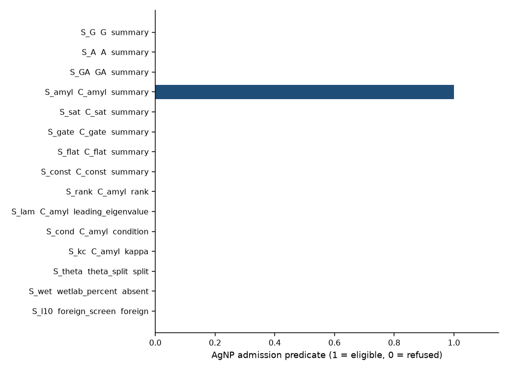
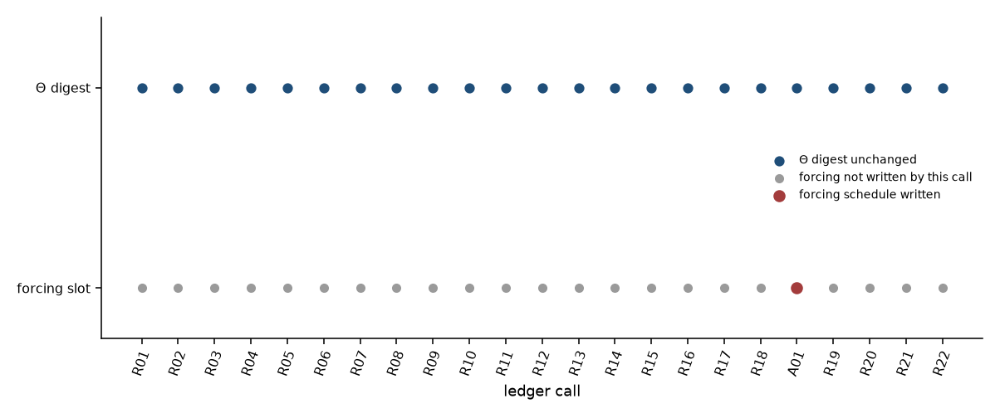
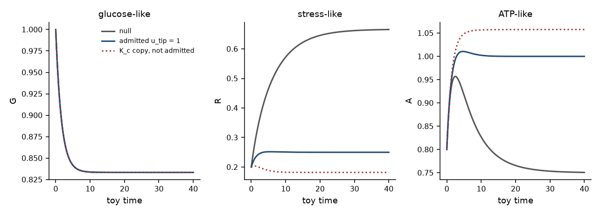
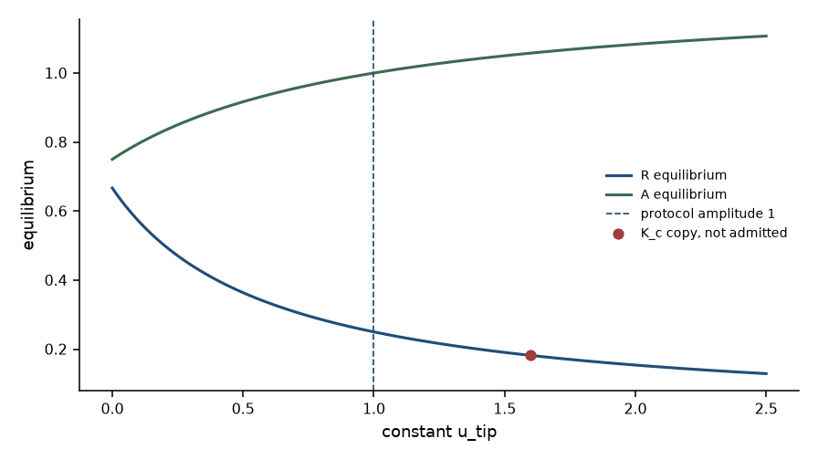

# Named AgNP observation-channel scores as forcing provenance under evidence gates

**Thesis #34. Computational research thesis**  
**Depends on:** Thesis #8 (papaya AgNP observation channel) and Thesis #19 (forcing admission under evidence gates)  
**Author:** Kelechi Emeka Ogbonna  
**Correspondence:** kelechiogbonna300@gmail.com · https://github.com/cloudynirvana/thesis-34-agnp-channel-forcing-provenance  
**Date:** 21 September 2026  
**Format:** B.Sc. project chapters (Nile University style), written as a computational methods manuscript  
**Status:** An AgNP-specific admission ledger on transcribed channel scores, plus a digest check on an inherited carrier. Not a dose.  
**Citation style:** numbered Vancouver. A `doi:` field appears only where Crossref returned the record.  
**DOI:** none for this document. Do not invent one.

---

## Title page

**NAMED AgNP OBSERVATION-CHANNEL SCORES AS FORCING PROVENANCE UNDER EVIDENCE GATES**

BY

**KELECHI EMEKA OGBONNA**

A COMPUTATIONAL RESEARCH THESIS  
(IN-SILICO ADMISSION LEDGER FOR ONE NAMED OBSERVATION CHANNEL)

SUBMITTED AS A CITEABLE MANUSCRIPT FOR JOURNAL / THESIS HANDOFF

PROJECT CONFLUENCE  
INDEPENDENT COMPUTATIONAL RESEARCH

SUPERVISOR: not appointed for this deposit

SEPTEMBER 2026

---

## Declaration

I, Kelechi Emeka Ogbonna, declare that this computational research thesis was carried out by me. The eligibility marks, reason codes, and digests reported here were produced by `sim/admission.py`. The script draws no random numbers. Channel summaries were transcribed from Thesis #8 and were not recomputed. Kinetic Θ is the six decimal strings of Thesis #19, reused as a control. No plate percentage from the 2022 wet-lab thesis was entered. No DOI, ORCID, or journal acceptance was invented for this document.

_________________________     _______________________  
Kelechi Emeka Ogbonna         Date

---

## Abstract

When a named papaya AgNP observation channel produces scores that are barred from Θ, which of those scores—if any—may be admitted only as provenance of a protocol-constant tip-ODE forcing without gate bypass or soft-prior leakage?

One record may. It is the class-B summary of `C_amyl`, the amylase-shaped channel named in Thesis #8. The ledger admits that summary once, as provenance of the constant schedule `u_tip = 1` on the interval [0, 40]. The provenance stores the channel name, the class label, the Thesis #8 results pin, and `score_copied: false`. It does not store the rank, the leading eigenvalue, the condition number, or the declared half-saturation.

The other fourteen transcribed records are ineligible under the same predicate with an empty slot. Seven of them are summaries of companion channels, including the constant map and the joint map. Each fails only `not_named_agnp_channel`. Four of them are numerals taken off `C_amyl` itself: the rank `3/6`, the leading eigenvalue `37012.18801964622`, the condition `1697990.8417235787`, and `K_c = 1.60`. Each fails only `numeral_not_provenance`. The class-A split 0.25, a wet-lab percent that the file does not contain, and the foreign screen identifier L10 from Thesis #19 fail because they are not channel scores.

Twenty-two calls return refused. One call, A01, is admitted. The SHA-256 of kinetic Θ is `1ace2bb9eed19f85046f25ab690076d0d5920cf19219ddb362c775be9f41d0e8` before the refusals and the same string after the admission. That string is the published kinetic digest of Thesis #19. The forcing digest changes. A soft-prior contrast that would have replaced `d0` with 0.195683 is computed beside the ledger and is not written. Copying `K_c` into the amplitude would have set the input to 1.60. That path is integrated in a side buffer and is not a ledger schedule.

The carrier is the Thesis #19 demonstration field, reimplemented so the digest can be checked. It is not a new biological equation. Glucose equilibrium does not depend on `u_tip`. The movement in the stress-like coordinate is a property of an exogenous constant at fixed Θ. It is not a glycaemic effect and not a dose.

Research only. Not a medical device, not clinical decision support, and not a cure. No document DOI.

---

## Keywords

silver nanoparticle; observation channel; α-amylase map; forcing provenance; evidence gate; protocol-constant input; kinetic digest; soft prior; research only

---

## Table of Contents

DECLARATION  
ABSTRACT  
Table of Contents  
List of tables and figures  

CHAPTER ONE. INTRODUCTION  
1.1 Background to the study  
1.2 STATEMENT OF RESEARCH PROBLEM  
1.3 JUSTIFICATION OF STUDY  
1.4 AIM AND OBJECTIVES OF THE STUDY  
1.5 SIGNIFICANCE OF THE STUDY  
1.6 SCOPE OF THE STUDY  

CHAPTER TWO. LITERATURE REVIEW  
2.1 A channel score is a property of a map  
2.2 A protocol-constant forcing is an input with a pointer  
2.3 A soft prior is a write that keeps the old name  
2.4 What this deposit does not inherit  

CHAPTER THREE. MATERIALS AND METHODS  
3.1 Design  
3.2 Transcribed channel records  
3.3 The admission predicate  
3.4 Kinetic Θ and the inherited carrier  
3.5 Digests  
3.6 Calls  
3.7 Contrasts that stay outside the ledger  
3.8 What was not done  

CHAPTER FOUR. RESULTS  
4.1 Who is eligible  
4.2 Twenty-two refusals, one digest  
4.3 The legal path  
4.4 The state can move while Θ stays  
4.5 Contrasts  
4.6 Checks  

CHAPTER FIVE. DISCUSSION, CONCLUSION AND RECOMMENDATION  
5.1 Discussion  
5.2 Conclusion  
5.3 Recommendation  

REFERENCES  
DISCLAIMER  

---

## List of tables and figures

**Table 3-1.** Kinetic Θ, the Thesis #19 control.  
**Table 3-2.** Predicate checks, in the order the script records them on a channel score.  
**Table 4-1.** Eligibility of the fifteen transcribed records.  
**Table 4-2.** Ledger calls. Every row has `theta_unchanged` true.  
**Table 4-3.** Carrier samples at fixed Θ. G agrees across the two ledger schedules.  
**Table 4-4.** Equilibria, and the two side-buffer inputs that were not written.

**Figure 4-1.** Eligibility under the AgNP predicate.  
**Figure 4-2.** Kinetic digest and forcing writes across the calls.  
**Figure 4-3.** Carrier trajectories at the null input, the admitted input, and the refused `K_c` copy.  
**Figure 4-4.** Equilibria of R and A against a constant `u_tip`.

Figures are diagnostics from `sim/admission.py`. They are not assays and not patient series.

---

# CHAPTER ONE

## 1.0 INTRODUCTION

### 1.1 Background to the study

A B.Sc. project at Nile University of Nigeria, dated July 2022, already ran the bench work this paper refuses to repeat [1]. Leaf extract of *Carica papaya* reduced silver. An in-vitro α-amylase assay compared wells. Those percentages, blanks, and spectra stay in that thesis. Green synthesis of silver colloids is a chemistry literature of its own, and one characterisation paper coats silver with papaya leaf extract and also reports a bactericidal test [2,3]. The bactericidal test is not a result here. The assay class itself is a comparison of wells, often by a glucose-oxidase kit when the question is enzyme activity in a plate [4]. Naming that class does not set a regimen.

Thesis #8 took the assay as an object and stopped it on the observation side of a dynamical model [5]. The legal object in that manuscript is a named map. The map called `C_amyl` is a saturating function of a substrate coordinate, with a declared half-saturation that is not a member of Θ. The illegal object is an inhibition fraction written into the catalytic term. On that toy the two choices are different calculations. Appending the fraction does not add a Fisher direction. Changing only the map changes the rank and the scale of the information, and it does not create the fraction. Structural identifiability is the older mathematical form of the same demand: a parameter is identifiable only relative to an output map and an experiment [6]. Thesis #1 had already separated a knowledge record from Θ [7]. Thesis #8 supplied the map the papaya assay would have to be if that separation is kept.

Thesis #19 asked a neighbouring question about a different table [8]. A phytochemical screen had been barred from writing scores into Θ. The question was which of those scores, if any, could still declare a known forcing. The answer on that ledger was narrow. Three rows were eligible. One of them, L10, was admitted as the provenance of a protocol-constant input `u_phyto = 1`. The numeral of the score was not copied. The SHA-256 of kinetic Θ did not move. A soft prior that would have moved a clearance was computed beside the ledger and was not written. Thesis #7 had already treated phytochemical and nanocarrier symbols as known inputs on a different three-state field, and had been explicit that those symbols are not efficacy [9]. Thesis #16 had stopped a surrogate screen on the evidence side of the gate [10]. Thesis #19 is the rule that keeps those two readings from winning by default.

The two published sentences can sit side by side and still leave a hole. Thesis #8 bars the AgNP channel's scores from Θ. Thesis #19 admits some scores, of a different screen, only as forcing provenance. Nothing in either sentence says what happens when the scores in the second sentence are the channel scores of the first. A later notebook can leave the kinetic vector untouched, copy the leading eigenvalue of `C_amyl` into an input slot, and describe the copy as compliance with both gates. That copy is the hole this thesis is for.

The carrier used below is not a new tumour model. Warburg's aerobic glycolysis, the later account of proliferative metabolism, the metabolic hallmarks, and the mathematical-oncology habit of treating a cartoon as a formal object explain why a small metabolic field is the sort of object the series keeps gating [11–15]. They are not compartments in the ledger. The field integrated in Chapter Four is the demonstration field of Thesis #19, with that thesis's kinetic strings, so that an unchanged digest is a comparison rather than a new parameter claim [8].

### 1.2 STATEMENT OF RESEARCH PROBLEM

When a named papaya AgNP observation channel produces scores that are barred from Θ, which of those scores—if any—may be admitted only as provenance of a protocol-constant tip-ODE forcing without gate bypass or soft-prior leakage?

The working form is a ledger. There is a transcribed file of Thesis #8 channel records [5]. There is one kinetic vector Θ, the Thesis #19 control, hashed as decimal strings [8]. There is one forcing symbol, `u_tip`, hashed separately. There is a predicate, fixed in `sim/admission.py` before the calls are issued. There is one legal amplitude, the string `"1"`, which is not a function of a rank, an eigenvalue, a condition number, or `K_c`. The question is which calls the predicate admits, and whether a refusal or the legal admission changes the digest of Θ.

A familiar way to miss the question is to treat the name `C_amyl` as permission to paste the leading eigenvalue into the differential equation, or to centre a Gaussian prior on a kinetic coordinate at a function of that eigenvalue and call the prior soft. Both of those are calls in Chapter Four. Both return refused. Another way to miss it is to treat every observation channel in Thesis #8 as if it were the named AgNP channel. The companion maps are calls as well.

### 1.3 JUSTIFICATION OF STUDY

The portfolio has the two objects and lacks the joint rule.

Thesis #8 forbids an inhibition fraction inside Θ and shows that a frozen Θ, read through different maps, yields different Fisher ranks and different eigenvalue scales [5,6]. It does not audit a forcing schedule. Thesis #19 audits a forcing schedule for a phytochemical screen whose claim codes and PAINS bits are not properties of `C_amyl` [8,10]. A reader who holds only Thesis #8 can conclude that no AgNP numeral may touch the dynamics in any role. A reader who holds only Thesis #19 can conclude that any shortlisted score may sit in a vector field as soon as the amplitude is a protocol constant. Applied to this channel, the two readings contradict each other.

The study is justified as the rule that keeps both readings from winning by default on this particular channel. A record that clears a predeclared predicate may authorize a schedule whose amplitude was written down without consulting the record's numerals. A record that fails the predicate authorizes nothing. A record that clears the predicate and is then used as the amplitude, as a prior mean, or as a coordinate of Θ, is a bypass. The digest is the witness. If Θ moved, the gate failed. If the forcing moved under a refused call, the gate failed in the other slot.

There is a second justification inside the channel list. Thesis #8 published eight maps [5]. Five of the class-B summaries transcribed here share the rank `3/6`. If the gate were "rank at least 3", the raw substrate map, the saturated map, the steep gate, and the flat gate would pass with `C_amyl`. Those maps are observation channels. They are not the named AgNP channel. The predicate has to be able to say so without sorting the eigenvalue column. The steep gate has the largest leading eigenvalue in the file. Sorting by scale would have selected it. That selection would have been a different paper.

The algebra that makes a catalytic inhibition unidentifiable is standard, and it is not re-derived here [16,17]. The literature on inputs treats a forcing as part of the experiment [18,19]. The literature on priors treats a prior mean as part of the posterior [20]. None of those literatures, by itself, names `C_amyl`. The justification is the naming [21,22].

### 1.4 AIM AND OBJECTIVES OF THE STUDY

The aim is to state an AgNP-specific admission predicate under which a score from the named papaya observation channel may become the provenance of a protocol-constant forcing, and to show, on transcribed Thesis #8 records, which calls the predicate refuses and which single call it admits, with the digest of kinetic Θ unchanged.

The objectives are:

1. Transcribe the Thesis #8 channel summaries, the class-A split, an empty wet-lab slot, and a foreign Thesis #19 identifier. Pin the file's SHA-256. Do not copy plate percentages.
2. Keep kinetic Θ equal to the Thesis #19 decimal strings, and hash it separately from the forcing.
3. State the predicate: channel score, source pin, `may_enter_theta` false, class B, not fitted to Thesis 0, channel constants outside Θ, channel equal to `C_amyl`, score part equal to `summary`, destination equal to `u_tip`, amplitude rule equal to `protocol_constant`, and a single empty slot.
4. Issue the illegal calls in Section 3.6, including a class-A write into Θ, numeral copies, a soft prior, a soft weight, companion channels, a wet-lab kind, the foreign identifier, forged flags, a relabelled channel, and a relabelled score part.
5. Admit one legal schedule, then show that a second write of the same record does not replace it.
6. Integrate the inherited carrier under the null schedule and under the admitted schedule with Θ held fixed.
7. Compute the soft-prior, `K_c`-copy, and affine contrasts in side buffers, and check that the ledger digest afterwards is the baseline digest.

Non-aims. Recomputing Thesis #8 Fisher matrices or profiles. Recomputing Thesis #19's phytochemical eligibility. Recomputing Thesis #7 Fisher ranks or `G_tip`. Editing the published TNBC right-hand side. Claiming that an admitted schedule is a dose, an IC50, or a change in any kinetic constant.

### 1.5 SIGNIFICANCE OF THE STUDY

The useful product is a rule that can fail in public. If `S_const` were eligible, the channel-name check would have failed. If A01 changed the kinetic digest, the separation of Θ from the forcing would have failed. If the glucose-like coordinate moved with `u_tip` by more than integrator noise, the carrier would not be the field written in Section 3.4. Those checks can be rerun without accepting a clinical sentence [21,22].

There is a second product inside the same script. Eligibility is a property of a record under the predicate. Admission is a write into a single slot. The rank column is transcribed and is not an input. `S_G` and `S_amyl` share the rank `3/6`, and only `S_amyl` is eligible. A later reader can see that the gate did not sort the column it was most likely to be asked to sort.

What the significance is not: a reanalysis of Thesis 0, a new Fisher table, a ranking of maps by eigenvalue, a dose of silver or of papaya extract, or a licence to paste `K_c` into `N_ROS` [1,5,7,9].

### 1.6 SCOPE OF THE STUDY

In scope. The predicate in Section 3.3. The twenty-three calls in Section 3.6. The hashed kinetic vector in Table 3-1. The inherited carrier in Section 3.4, integrated on [0, 40] from the stated initial condition. Closed forms for the glucose-like and stress-like coordinates. One side-buffer prior and two side-buffer amplitudes.

Out of scope. Patient data. Re-fitting Thesis 0. A new α-amylase experiment. Estimation of `K_c`, β, or `g*`. The quadratic ROS term and the constant glucose sink of the published TNBC model [9]. The `G_tip` functional. A stochastic likelihood, except the one normal–normal contrast that is not written. A second admitted schedule. Regulatory use.

---

# CHAPTER TWO

## 2.0 LITERATURE REVIEW

### 2.1 A channel score is a property of a map

Structural identifiability asks whether the input–output map determines the parameter vector [6,19]. It does not ask whether a neighbouring table of scores looks decisive. In physiological models the data often determine a combination, and the combination is not a licence to publish both names that were typed into the product [16]. Profile likelihood later separates a flat structural direction from a valley that finite noise fails to close [23]. Practical identifiability is about the experiment that was run [24]. Sloppy spectra warn that a full-rank Fisher matrix can still leave individual coordinates poorly constrained [20,25]. Nonlinear ODE models remain only partly observed even when the equations are known [26].

Thesis #8 used that stack on a two-state toy and a frozen six-vector [5]. The honest object was the channel tuple `(name, h, κ)`, with κ declared and not appended to Θ. The dishonest object was θ inside the catalytic term. On the joint map the augmented Fisher rank was 6 of 7 and the column cosine of `v` and θ was −1. With Θ frozen, maps of the substrate coordinate had rank 3 of 6, and their leading eigenvalues still differed by orders of magnitude. The constant map had rank 0. Those eigenvalues are scores of the maps. They are not coordinates of Θ, and they are not IC50 values. Michaelis and Menten's constant already contained the ambiguity: a factor that multiplies a limiting rate is seen as a product [17,27]. Thesis #8 made the product explicit and then refused to split it.

This chapter does not repeat that Fisher table as a new measurement. It uses the published summaries as records. A record can be the provenance of an input only if a later predicate says so. The numeral inside the record does not, by being a numeral, complete an identification step [6,18].

### 2.2 A protocol-constant forcing is an input with a pointer

Control and identification treat inputs as part of the experiment [18,19]. A molecular systems model can carry an exogenous signal. The signal is an argument of the vector field. It is not a coordinate of Θ merely because a biologist has a name for it [18]. No organisational level owns causation just by being named [28]. Assumptions should be visible, because a model is a set of choices a reader must be able to contest [29].

Thesis #7 made the split concrete on a published three-state field. `N_DOX` and `N_ROS` are piecewise-constant inputs. The kinetic vector does not include those symbols. A notebook that rewrites a rate inside a treated dictionary is changing Θ [9]. Thesis #19 kept the distinction and added the rule the shortcut had avoided: a score barred from Θ may authorize a schedule whose amplitude was fixed without the score, and may not donate the score as the amplitude [8]. The symbol in that thesis is `u_phyto`. Declaration is not inherited by a symbol name. A new ledger has to name its own symbol, or the name becomes a side door.

The field integrated in Chapter Four is the Thesis #19 carrier, for a reason that belongs in the methods. The logical split is the object under test. The particular right-hand side is a control. Reusing the kinetic strings makes the digest comparable. Inventing a new Θ would have made an unchanged digest uninformative, because there would have been no published string to match.

### 2.3 A soft prior is a write that keeps the old name

A prior is part of the posterior, and it is often intelligible only once the likelihood is stated [20]. Prior–data conflict is a check one can run when the prior and the observation disagree [30]. Bayesian calibration of a computer model has the same exposure: the statistical layer can attribute discrepancy to a parameter, and the attribution depends on what was allowed to move [31]. Model discrepancy, left unstated, is easily absorbed into a physical parameter the investigator meant to keep fixed [32]. The scientific task is to keep that absorption inspectable [33].

The leakage refused here is specific. Let `d0` keep the declared string `0.15`, and let a Gaussian prior for `d0` have a mean that moves when the log of the `C_amyl` leading eigenvalue moves. A normal–normal update then returns a posterior mean different from `0.15`. Writing the posterior mean back is a write into Θ. Leaving it unwritten and still citing the eigenvalue as regularisation of the same coordinate is the same write described more gently. Chapter Three puts the update in a side buffer. Chapter Four records the posterior mean and the digest that mean would have produced.

An affine map from the same logarithm onto a forcing amplitude is the input-side version of the habit. The variance is absent, so the map is harder to mistake for a belief. The predicate rejects it under the amplitude rule. Copying `K_c` is the same rejection with a shorter map. `K_c` was declared as a constant of `h` [5]. Giving it to `u_tip` assigns the constant a clearance dimension the channel file does not claim. Sloppiness does not repair that assignment. A large eigenvalue is still a property of a map [20,25].

### 2.4 What this deposit does not inherit

Reproducibility, in the narrow sense used here, means that a second run of the same bytes produces the same digests [34–36]. It does not mean that the toy equilibrium is a glycaemic time course, and it does not mean that a reader may copy the protocol amplitude into a laboratory protocol [22,36]. FAIR recording is cited for the pin and the provenance fields, not as a claim that this deposit is a clinical dataset [35].

Four inheritances are refused explicitly.

The plate tables of Thesis 0 are not results of this thesis [1]. The Fisher ranks, profiles, and standard-error sketches of Thesis #8 are not recomputed [5]. The claim table, surrogate weights, and eligibility set of Thesis #19 are not recomputed [8,10]. The Fisher ranks and `G_tip` numbers of Thesis #7 are not results here [9]. Each of those manuscripts remains the authority for its own object. This manuscript cites them and then does a different thing: it decides whether a record Thesis #8 already classified may authorize an input whose kinetic digest is the one Thesis #19 already published.

Natural-product catalogues remain catalogues [37]. A mnemonic in a toy channel list is not a prescription. The hallmarks literature is the reason a metabolic cartoon is worth gating [11–15,38]. It is not a compartment list for `u_tip`.

---

# CHAPTER THREE

## 3.0 MATERIALS AND METHODS

### 3.1 Design

Computational ledger study. No patient-identifiable data. No wet-lab assay. No docking engine. No random-number draw: `rng_draws` in `sim/results.json` is 0.

The input file is `sim/candidates.json`. Its SHA-256 is pinned inside `sim/admission.py`. A byte-level mismatch raises before any call is issued. The pin for the file as stored in this deposit is `6d7bb8b9d99302dd8d90361bc3d95f792b19ac0ddf99445693557dc97445ca5e`.

The Thesis #8 results file that the summaries were copied from has SHA-256 `a62bd39023418c48c3b3fdff13cde90e6a136ea7a813ab0ab935feff6d985697`. That pin is stored in the candidate file and is checked by the predicate. The Fisher matrices behind it were not rerun. Materials otherwise are the two prior theses [5,8], the identifiability and prior literature cited in Chapter Two [6,16–20,23–33], and the assay-class literature cited in Chapter One [1–4]. The carrier was reimplemented from the Thesis #19 field. It was not taken from `tnbc_model.py`.

### 3.2 Transcribed channel records

The file holds fifteen records.

Eight are class-B summaries, one for each map in Thesis #8's channel list: `G`, `A`, `GA`, `C_amyl`, `C_sat`, `C_gate`, `C_flat`, and `C_const` [5]. Each summary stores the published rank as a string such as `3/6`, the leading eigenvalue as printed in that thesis's results file, and the condition of the retained block where the condition is defined. `C_const` has rank `0/6`, leading eigenvalue `0.0`, and a null condition. `C_amyl` also stores the declared constant `K_c=1.60`. `C_sat`, `C_gate`, and `C_flat` store their own declared constants. Those constants are citations of Thesis #8's Table 3-2. They are not estimates, and they are not members of Θ.

Four further records split numerals off the `C_amyl` summary, so that a call can ask to use the numeral itself: `S_rank` holds `3/6`, `S_lam` holds `37012.18801964622`, `S_cond` holds `1697990.8417235787`, and `S_kc` holds `1.60`. The predicate in Section 3.3 does not read these strings when it decides eligibility. They exist so a refused contrast can name the numeral it did not write.

Three records are not channel scores. `S_theta` holds the class-A nominal split `0.25` from Thesis #8, where the product of the catalytic coefficient and `(1 − θ)` equals 1.10 [5]. `S_wet` has a null numeral and records that a Thesis 0 percent inhibition was not transcribed [1]. `S_l10` names the Thesis #19 identifier L10 and does not copy that screen's scores [8].

Document flags, shared by the file, are `may_enter_theta` false, `theta_frozen` true, class label `B`, `fitted_to_thesis0` false, and `kappa_outside_theta` true. The named AgNP channel is the string `C_amyl`.

### 3.3 The admission predicate

A call is a request with a kind, an optional record, a destination symbol, and an amplitude rule. The script collects every failed check. An empty failure list means the call may be admitted. The slot check is applied only when every other check has passed, so a call that is illegal for a substantive reason is not also labelled as a mere occupant of a full slot.

On a kind that is not `channel_score`, the script records that failure, records a soft-prior or soft-weight rule if one was asked for, records a bad destination, records a non-protocol amplitude, and returns. It does not audit a channel name the record does not have.

**Table 3-2.** Checks, in the order the script records them on a channel score.

| Check | Reason code | Admitted value |
| --- | --- | --- |
| Kind is a channel score | `not_a_channel_score` | kind = channel_score |
| Rule is not a soft prior | `soft_prior` | amplitude rule = protocol_constant |
| Rule is not a score weight on a kinetic coordinate | `soft_weight` | amplitude rule = protocol_constant |
| Destination is not a name in Θ | `theta_destination` | destination = `u_tip` |
| Destination is the declared forcing symbol | `symbol` | destination = `u_tip` |
| Call does not relabel the record's channel | `channel_mismatch` | channel read from the record |
| Call does not relabel the record's score part | `part_mismatch` | part read from the record |
| Results SHA-256 equals the transcribed Thesis #8 pin | `source_pin` | pin in Section 3.2 |
| `may_enter_theta` is false | `may_enter_theta` | false |
| Class is B and θ is not free | `class_A` | class B, free_theta false |
| Record was not fitted to Thesis 0 | `wetlab_fit` | fitted_to_thesis0 false |
| Channel constants stay outside Θ | `kappa_in_theta` | kappa_outside_theta true |
| Channel is the named AgNP channel | `not_named_agnp_channel` | `C_amyl` |
| Score part is the summary, not a numeral | `numeral_not_provenance` | summary |
| Amplitude rule is `protocol_constant` | `amplitude_rule` | protocol_constant |
| Forcing slot is still the null schedule | `slot_occupied` | one write only |

The channel name and the score part are read from the stored record after a mismatch has been noted. A call that writes `channel: C_amyl` onto the constant-map record does not become `C_amyl`. A call that writes `score_part: summary` onto the eigenvalue record does not become a summary. The amplitude that a successful call writes is the string `"1"`, constant on [0, 40]. That string is not taken from a rank, an eigenvalue, a condition, or `K_c`. Provenance on the written schedule records the channel, the class, the results pin, `score_part: summary`, and `score_copied: false`. It does not record the numerals.

For a non-channel kind, `amplitude_rule` is recorded on the early path, before any channel code. That is why a class-A call can list `amplitude_rule` without listing `numeral_not_provenance`. The channel block was not entered.

### 3.4 Kinetic Θ and the inherited carrier

Θ is six positive constants. They are stored as decimal strings so that the digest does not depend on a binary float's JSON rendering. The strings are the Thesis #19 kinetic vector [8]. Reusing them is the control.

**Table 3-1.** Kinetic Θ.

| Name | Role in the carrier | Stored string |
| --- | --- | --- |
| `u_in` | constant influx of the glucose-like state | 0.50 |
| `k_glyc` | linear consumption of that state | 0.60 |
| `g` | yield of the stress-like state | 0.20 |
| `d0` | basal clearance of the stress-like state | 0.15 |
| `d_u` | extra clearance per unit of forcing | 0.25 |
| `s` | linear clearance of the ATP-like state | 0.40 |

Let G be a glucose-like state, R a stress-like state, and A an ATP-like state, all dimensionless. Let `u(t)` be the forcing. On this deposit `u(t)` is constant, either 0 or the admitted value. The field is

dG/dt = u_in − k_glyc G

dR/dt = g k_glyc G − (d0 + d_u u) R

dA/dt = k_glyc G / (1 + R) − s A

The forcing multiplies `d_u` inside the clearance of R. It does not appear in the equation for G. It does not replace any coordinate of Θ. Initial state: (G, R, A) = (1, 0.20, 0.80). Horizon: t ∈ [0, 40]. Integration: LSODA, relative tolerance 10−8, absolute tolerance 10−11, 401 stored nodes.

The equilibrium at a constant input u is closed form:

G* = u_in / k_glyc

R* = g u_in / (d0 + d_u u)

A* = u_in / (s (1 + R*))

G* does not depend on u. That is the algebraic content of the separation, and it is the fact an amylase-shaped provenance is not allowed to narrate away. With the numbers in Table 3-1, the null input u = 0 gives G* = 0.833333, R* = 0.666667, A* = 0.750000. The protocol input u = 1 gives the same G*, R* = 0.250000, and A* = 1.000000.

G(t) and R(t) also have closed forms for constant u, because the glucose equation is linear and the stress equation is linear once G(t) is known. The script compares those forms with the numerical trajectory and raises if the maximum absolute gap exceeds 10−7. The ATP equation sees R(t) in a denominator, so A(t) is numerical. Its equilibrium formula is still algebraic.

This field is a bounded carrier for the ledger. It is the Thesis #19 carrier, reimplemented so the bytes can be hashed here [8]. It is not `tnbc_model.py`. It has no quadratic source term. Those choices were already made in Thesis #19, which declined to edit the TNBC right-hand side [9]. This deposit does not reopen that decline. The symbol of the forcing in this ledger is `u_tip`. It is not `u_phyto`, and it is not the influx `u` of the Thesis #8 toy.

### 3.5 Digests

The digest of an object is the SHA-256 hex digest of its canonical JSON: keys sorted, separators `(',', ':')`, UTF-8, no insignificant whitespace. Θ is digested from the decimal strings in Table 3-1. The forcing schedule is digested as its own object, including provenance when a schedule has been admitted. A state digest is the SHA-256 of the 401 stored samples after rounding time to 10 decimal places and each state to 12 decimal places.

A call is required to leave the byte string of Θ unchanged. The script compares that byte string at the end of the run with the byte string taken before the first call. A refused call is also required to leave the forcing digest unchanged. After A01, a later refusal is required to leave the admitted forcing digest unchanged. The baseline kinetic digest is required to equal the published Thesis #19 string `1ace2bb9eed19f85046f25ab690076d0d5920cf19219ddb362c775be9f41d0e8`.

### 3.6 Calls

Twenty-three calls are issued in a fixed order. The first eighteen are constructed so that each substantive reason in Table 3-2 has at least one witness before any schedule is written. A01 is the legal call: record `S_amyl`, destination `u_tip`, amplitude rule `protocol_constant`, stored flags untouched. R19 names `S_amyl` again after the slot is full. R20 names the joint channel `GA` after the slot is full and should fail the channel name, not the occupancy code. R21 names the constant channel and writes `C_amyl` into the call. R22 names the eigenvalue record and writes `summary` into the call.

The illegal constructions are: the class-A split aimed at `d0`; the eigenvalue numeral aimed at `u_tip`; the rank as a soft prior on `d0`; the eligible summary with its eigenvalue copied into the amplitude; `K_c` copied into the amplitude; the constant channel and the gate channel asked to authorize the protocol schedule; the empty wet-lab kind; L10 aimed at `u_phyto`; the eligible summary aimed at `d0`, at `u_phyto`, and at `N_ROS`; the eligible summary with `may_enter_theta` set true, with the class overwritten to A, with one hex character of the results pin flipped, with `fitted_to_thesis0` set true, and with channel constants moved into Θ; and the eigenvalue as a weight on `s`.

No call reads a rank in order to pass. No call refits Θ. No call loads a plate table.

### 3.7 Contrasts that stay outside the ledger

Three numerals are computed after the calls, in objects that are not assigned to the ledger.

The soft prior uses L = log10(37012.18801964622), the leading eigenvalue stored on `S_amyl`. The prior mean of `d0` is 0.15 + 0.02 × L. The fictional observation is the declared value 0.15. Both the prior and the observation have standard deviation 0.05, so the posterior mean is the average of the prior mean and 0.15. The script hashes the kinetic vector that would result from replacing the stored `d0` string with that posterior mean, formatted to 16 digits after the decimal. It does not perform the replacement.

The `K_c` copy sets u = 1.60. The affine amplitude is u = 0.20 + 0.50 × L. Both are integrated with the baseline Θ so that Chapter Four can show they are different inputs. Neither integration is allowed to replace the forcing object. The class-A product 1.10 is not used as an amplitude. The pair of roadmap tip values discussed in Thesis #7 and Thesis #19 is not recomputed [8,9].

### 3.8 What was not done

No absorbance from Thesis 0 was digitised [1]. No Fisher matrix from Thesis #8 was rebuilt [5]. No profile likelihood of that toy was redrawn. No rank from Thesis #19 was recomputed [8]. No descriptor from Thesis #16 was rescored [10]. No Fisher matrix of the TNBC three-state model was formed [9]. `G_tip` was not evaluated. Θ was not estimated from data. `K_c`, β, and `g*` were not estimated. The normal–normal update is an arithmetic witness, not a posterior from a dynamical likelihood [20,30]. A global structural-identifiability certificate was not computed [6,26]. No dose was recommended [22].

---

# CHAPTER FOUR

## 4.0 RESULTS

Every status, digest, and trajectory number in this chapter comes from `sim/admission.py` writing `sim/results.json`. The run makes no random draw. The ledger numbers are properties of the predicate and the transcribed file. The trajectory numbers are properties of the inherited carrier at the stated inputs. They are not patient outcomes, and they are not a new assay.

### 4.1 Who is eligible

The predicate of Section 3.3, evaluated on each transcribed record with the protocol-constant rule, the declared symbol, the stored flags, and an empty slot, returns eligible for one identifier: `S_amyl`. That is the class-B summary of `C_amyl`. The other fourteen records return a reason. Figure 4-1 is that pattern. The bar height is 1 or 0. It is not an eigenvalue.

**Table 4-1.** Eligibility. Rank is transcribed from Thesis #8 and is not an input to the predicate.

| ID | Object | Part | Rank | Eligible | Reason if refused |
| --- | --- | --- | --- | --- | --- |
| S_G | G | summary | 3/6 | no | not_named_agnp_channel |
| S_A | A | summary | 4/6 | no | not_named_agnp_channel |
| S_GA | GA | summary | 6/6 | no | not_named_agnp_channel |
| S_amyl | C_amyl | summary | 3/6 | yes | — |
| S_sat | C_sat | summary | 3/6 | no | not_named_agnp_channel |
| S_gate | C_gate | summary | 3/6 | no | not_named_agnp_channel |
| S_flat | C_flat | summary | 3/6 | no | not_named_agnp_channel |
| S_const | C_const | summary | 0/6 | no | not_named_agnp_channel |
| S_rank | C_amyl | rank | — | no | numeral_not_provenance |
| S_lam | C_amyl | leading eigenvalue | — | no | numeral_not_provenance |
| S_cond | C_amyl | condition | — | no | numeral_not_provenance |
| S_kc | C_amyl | K_c | — | no | numeral_not_provenance |
| S_theta | class-A split | split | — | no | not_a_channel_score |
| S_wet | wet-lab percent, absent | absent | — | no | not_a_channel_score |
| S_l10 | Thesis #19 L10 | foreign | — | no | not_a_channel_score |

Five summaries share the rank `3/6`: `S_G`, `S_amyl`, `S_sat`, `S_gate`, and `S_flat`. One of them is eligible. `S_const` has rank `0/6` and `S_GA` has rank `6/6`, and both fail with the same reason code as the saturated map. The predicate is reading the channel name. It is not sorting the rank column, and it is not sorting the eigenvalue column. The steep gate's leading eigenvalue, `1403432.5857267028`, is the largest in the file. The record is `S_gate`, and it is ineligible. The four numerals that belong to `C_amyl` are ineligible for a different reason. They are the right channel and the wrong part.

**Figure 4-1.** A bar of height 1 is an eligible record. A bar of height 0 is refused by the predicate before any schedule is written. `S_amyl` is the eligible record.

### 4.2 Twenty-two refusals, one digest

The kinetic digest before any call is

`1ace2bb9eed19f85046f25ab690076d0d5920cf19219ddb362c775be9f41d0e8`.

That is the Thesis #19 kinetic digest. The null forcing digest, for the symbol `u_tip`, is

`aff2ce6750d80780cea53b3b832459fba26ddff2267c33d3a1f46de1ae77a53f`.

**Table 4-2.** Calls in issue order. Every row has `theta_unchanged` true.

| Call | Record | Destination | Amplitude rule | Status | Reasons |
| --- | --- | --- | --- | --- | --- |
| R01 | S_theta | `d0` | copy_score | refused | not_a_channel_score, theta_destination, amplitude_rule |
| R02 | S_lam | `u_tip` | copy_eigenvalue | refused | numeral_not_provenance, amplitude_rule |
| R03 | S_rank | `d0` | soft_prior | refused | soft_prior, theta_destination, numeral_not_provenance, amplitude_rule |
| R04 | S_amyl | `u_tip` | copy_eigenvalue | refused | amplitude_rule |
| R05 | S_kc | `u_tip` | copy_kappa | refused | numeral_not_provenance, amplitude_rule |
| R06 | S_const | `u_tip` | protocol_constant | refused | not_named_agnp_channel |
| R07 | S_gate | `u_tip` | protocol_constant | refused | not_named_agnp_channel |
| R08 | S_wet | `u_tip` | protocol_constant | refused | not_a_channel_score |
| R09 | S_l10 | `u_phyto` | protocol_constant | refused | not_a_channel_score, symbol |
| R10 | S_amyl | `d0` | protocol_constant | refused | theta_destination |
| R11 | S_amyl | `u_phyto` | protocol_constant | refused | symbol |
| R12 | S_amyl | `N_ROS` | protocol_constant | refused | symbol |
| R13 | S_amyl | `u_tip` | protocol_constant | refused | may_enter_theta |
| R14 | S_amyl | `u_tip` | protocol_constant | refused | class_A |
| R15 | S_amyl | `u_tip` | protocol_constant | refused | source_pin |
| R16 | S_amyl | `u_tip` | protocol_constant | refused | wetlab_fit |
| R17 | S_amyl | `u_tip` | protocol_constant | refused | kappa_in_theta |
| R18 | S_lam | `s` | soft_weight | refused | soft_weight, theta_destination, numeral_not_provenance, amplitude_rule |
| A01 | S_amyl | `u_tip` | protocol_constant | admitted | — |
| R19 | S_amyl | `u_tip` | protocol_constant | refused | slot_occupied |
| R20 | S_GA | `u_tip` | protocol_constant | refused | not_named_agnp_channel |
| R21 | S_const | `u_tip` | protocol_constant | refused | channel_mismatch, not_named_agnp_channel |
| R22 | S_lam | `u_tip` | protocol_constant | refused | part_mismatch, numeral_not_provenance |

Several rows are the cases that would be easy to narrate as exceptions.

R04 names the same record A01 will later admit, and asks to use the eigenvalue as the amplitude. The only reason is `amplitude_rule`. A `C_amyl` summary may authorize the protocol schedule. It may not donate its numeral. R02 asks the eigenvalue record itself to do that donation, and fails the part check as well as the amplitude rule. R05 asks `K_c` to be the amplitude. The declared half-saturation is not a schedule. R06 asks the constant channel, whose rank is 0, to authorize the protocol schedule. R07 asks the steep gate, whose leading eigenvalue is the largest in the file. Both fail only the channel name. Rank and scale do not rescue a companion map, and they do not specially punish the constant map.

R01 aims the class-A split at `d0`. The split is not a channel score, and the destination is a kinetic name. R10 aims the legal summary at the same kinetic name under the protocol rule. Eligibility is not permission to edit Θ. R11 aims the legal summary at `u_phyto`, the symbol of Thesis #19 [8]. R12 aims it at `N_ROS`, the input name of Thesis #7 [9]. Neither symbol is declared here. R09 aims the foreign identifier L10 at `u_phyto`. The screen that Thesis #19 admitted is not an AgNP channel score, and its symbol is not inherited.

R13 through R17 take the legal record and the legal rule and break one stored flag at a time: the permission to enter Θ, the class, the results pin, the wet-lab-fit flag, the placement of κ. Each returns a single reason. R18 puts the eigenvalue on `s` as a weight. The weight is a write aimed at Θ.

Across R01–R18 the forcing digest remains the null digest. The kinetic digest remains the baseline. Figure 4-2 marks the kinetic row as unchanged on every call.

**Figure 4-2.** Blue marks: the SHA-256 of Θ matches the baseline after the call. Grey marks: the call did not write the forcing. The red mark is A01, the only write into the forcing slot.

### 4.3 The legal path

A01 admits `S_amyl`. The stored schedule is the constant string `"1"` from t = 0 to t = 40, with amplitude rule `protocol_constant`. Provenance records channel `C_amyl`, class B, the Thesis #8 results pin, `score_part` summary, and `score_copied` false. The forcing digest becomes

`4a9b382f6976015102a639acb65bb9a559871ff5e47a611147db9a4c47e0a6cb`.

The kinetic digest does not. After A01 it is still

`1ace2bb9eed19f85046f25ab690076d0d5920cf19219ddb362c775be9f41d0e8`.

The canonical forcing payload contains none of the transcribed numeral strings. The script raises if any such string is found. The admitted object is a schedule plus a pointer. It is not a rank, not an eigenvalue, and not `K_c`.

R19 then names `S_amyl` again and asks for the same protocol rule. The only reason is `slot_occupied`. The forcing digest stays on the A01 value. One admission does not become a second copy of the same pointer. R20 names `S_GA` after the slot is full. It fails `not_named_agnp_channel`, so the slot code is not added. The digest check is separate: the forcing hash after R20 is still the A01 hash.

R21 names `S_const` and writes `C_amyl` into the call. The record's channel remains `C_const`. The reasons are `channel_mismatch` and `not_named_agnp_channel`. A relabel in the request does not rewrite the transcription. R22 names `S_lam` and writes `summary` into the call, with the protocol rule, so that the amplitude check would have passed if the part had been real. The reasons are `part_mismatch` and `numeral_not_provenance`. The eigenvalue record stays an eigenvalue record. Neither late call changes the forcing digest.

The choice of `S_amyl` is the only choice the predicate leaves open. Had the legal call named `S_gate`, Table 4-1 says it would have been refused. The script's witness is R07.

### 4.4 The state can move while Θ stays

Θ is held at Table 3-1 for every integration in this section. The null path uses u = 0. The admitted path uses u = 1. These are the two ledger schedules. The dotted path in Figure 4-3 uses u = 1.60 and is the side buffer of Section 4.5.

The glucose-like paths of the two ledger schedules overlie. The maximum absolute difference on the 401-node grid is 1.268×10−9. That is integrator noise on an equation that does not contain u. At the reporting times in Table 4-3 the glucose samples agree to the digits shown. Both paths end at G = 0.833333. The algebraic statement that G* is independent of u is the equilibrium case of the same fact.

The stress-like and ATP-like paths separate. Under the null schedule the stress equilibrium is 0.666667. At t = 40 the numerical value is 0.665620, still 0.001047 short of equilibrium, because the basal clearance is 0.15 and the transient has not finished decaying. Under the admitted schedule the clearance is 0.40, the equilibrium is 0.250000, and the terminal gap is 5.462×10−9. The ATP-like equilibrium moves from 0.750000 to 1.000000 because A sees R. The terminal ATP gap on the admitted path is 3.107×10−8.

The maximum absolute gap between the full null state and the full admitted state, over coordinates and time, is 0.415620. The state digest moves with that gap. The null state digest is `1486bf2a2e592d568e331c236c7df808729d998357abd36fc58d9b377594244c`. The admitted state digest is `e5add31f87ea178b57a9e5fa754c8c3ce715c0a36ec804ee358ea5c08e99e484`. Those two strings reproduce the carrier digests published in Thesis #19, which is the check that this script did not edit the field or the protocol amplitude [8]. The kinetic digest is the one quoted in Section 4.2, on both paths. The forcing digest does not reproduce Thesis #19's forcing digest, because the symbol is `u_tip` and the provenance is `C_amyl`.

**Table 4-3.** Samples from `sim/results.json`, six digits. G agrees across the two ledger schedules.

| t | G null | R null | A null | G admitted | R admitted | A admitted |
| ---: | ---: | ---: | ---: | ---: | ---: | ---: |
| 0 | 1.000000 | 0.200000 | 0.800000 | 1.000000 | 0.200000 | 0.800000 |
| 5 | 0.841631 | 0.465010 | 0.917185 | 0.841631 | 0.251788 | 1.010465 |
| 10 | 0.833746 | 0.572346 | 0.826742 | 0.833746 | 0.250668 | 1.002335 |
| 20 | 0.833334 | 0.645645 | 0.765622 | 0.833334 | 0.250016 | 1.000011 |
| 40 | 0.833333 | 0.665620 | 0.750755 | 0.833333 | 0.250000 | 1.000000 |

Closed-form checks on G and R stay inside the tolerance. On the null path the maximum absolute gaps are 5.083×10−9 for G and 2.778×10−9 for R. On the admitted path they are 4.725×10−9 and 2.204×10−9.

**Table 4-4.** Equilibria at the two ledger inputs, and the absolute gap of the t = 40 state from that equilibrium. The side-buffer rows were not written.

| Schedule | u | G* | R* | A* | gap R(40) | gap A(40) |
| --- | ---: | ---: | ---: | ---: | ---: | ---: |
| Null | 0 | 0.833333 | 0.666667 | 0.750000 | 0.001047 | 0.000755 |
| Admitted | 1 | 0.833333 | 0.250000 | 1.000000 | 5.462×10−9 | 3.107×10−8 |
| K_c copy, not written | 1.60 | 0.833333 | 0.181818 | 1.057692 | 1.220×10−10 | 1.332×10−8 |
| Affine, not written | 2.484172 | 0.833333 | 0.129694 | 1.106494 | 1.053×10−11 | 6.018×10−9 |

**Figure 4-3.** Solid grey: null forcing. Solid blue: admitted protocol forcing. Dotted red: the `K_c` copy of Section 4.5, which is not a ledger schedule. G does not separate. R and A do.

Figure 4-4 draws the stress and ATP equilibria against a constant input. The vertical line is the protocol amplitude. The red point is the refused `K_c` copy, plotted on the R* curve and not admitted.

**Figure 4-4.** R* and A* as functions of a constant `u_tip`. The vertical line is the protocol amplitude 1. The red point is u = 1.60, plotted on the R* curve and not admitted.

The movement in R and A is a property of an exogenous input at fixed Θ. It is not a change in `k_glyc` or `d0`. It is not a claim that the ATP-like state has been restored, and it is not an α-amylase inhibition [4,5,22]. Because G* does not contain u, an admitted `C_amyl` provenance cannot be read off the glucose coordinate. That is the separation the channel's name makes tempting to ignore.

### 4.5 Contrasts

The soft-prior buffer uses L = log10(37012.18801964622) = 4.568345. The prior mean of `d0` is 0.241367. The posterior mean is 0.195683. Replacing the stored string `0.15` with that posterior mean would produce the kinetic digest `62a6aa857bd909d33c5f78334c554bad967ec6017cf26cda9eb73adc874786a1`, which is not the ledger digest. The flag `written_to_ledger_theta` is false. After the buffer is computed, the ledger digest is still the baseline in Section 4.2. The arithmetic shows that a shift of this size is a different Θ. The predicate's refusal of R03 is what keeps a rank-driven prior out of the ledger, and the side buffer is what shows that the eigenvalue would have done the same kind of damage if it had been written [20,30].

The `K_c` buffer sets u = 1.60. Integrated at baseline Θ, the terminal state is G = 0.833333, R = 0.181818, A = 1.057692. The stress equilibrium at this illegal amplitude is 0.181818, which is not the admitted equilibrium 0.250000. The path is the dotted curve in Figure 4-3. It was not written into the forcing slot. R05 is the refusal that corresponds to it.

The affine buffer sets u = 0.20 + 0.50 × 4.568345 = 2.484172. The terminal state at baseline Θ is G = 0.833333, R = 0.129694, A = 1.106494. That path is a third input. It was not written. R04 is the refusal of copying the eigenvalue off the eligible summary, and R02 is the refusal of treating the eigenvalue record as if it were already an amplitude.

`S_wet` remains a null numeral. R08 returns `not_a_channel_score`. There is no percent inhibition in the forcing payload because there is no percent inhibition in the file [1].

### 4.6 Checks

The candidate-file pin matches Section 3.1, or the script would have raised before Table 4-1. The eligible set is exactly {`S_amyl`}. Every companion summary fails only `not_named_agnp_channel`. Every `C_amyl` numeral fails only `numeral_not_provenance` when the legal rule and the legal symbol are used. Exactly one call, A01, has status admitted. The byte string of Θ at the end equals the byte string taken before R01. That digest equals the Thesis #19 kinetic digest. Every call record has `theta_unchanged` true. Calls R01–R18 leave the null forcing digest in place. Calls R19–R22 leave the admitted forcing digest in place. No numeral string appears in the admitted payload. Closed-form gaps for G and R on the integrated paths stay below 10−7. G* is identical at u = 0 and u = 1. The null and admitted state digests differ, and they match the published carrier digests. The soft-prior digest differs from the ledger digest and was not written. The script raises on any of these failures. This run did not raise.

---

# CHAPTER FIVE

## 5.0 DISCUSSION, CONCLUSION AND RECOMMENDATION

### 5.1 Discussion

The question in Section 1.2 has a qualified answer on this ledger. One score may be admitted, and what it may be admitted as is the provenance of a schedule whose amplitude was fixed without it. On the transcribed file that score is the class-B summary of `C_amyl`. The demonstration admits it once, as the provenance of `u_tip = 1`. The rank, the leading eigenvalue, the condition, and `K_c` are stored on or beside that summary and are refused when a call tries to use them. The seven companion channels remain observation channels in Thesis #8 and are not the named AgNP channel here. No numeral in the file is admitted as a coordinate of Θ or as a numeral inside the forcing.

The qualification is the whole predicate, not the channel name alone. R04 shows that the record which later clears A01 is refused when the amplitude rule copies the eigenvalue. R10 shows that the same record is refused when the destination is `d0`. R13–R17 show that the same record and the same rule are refused when a flag is forged. R06 and R07 show that the protocol amplitude does not wash a companion name, whether the companion saw nothing or saw the state sharply. A rule that checked only "this file came from Thesis #8" would have admitted several of those calls. The digest of Θ would still have been saveable, if the write went into the forcing, and the save would have been a false comfort. The forcing digest is the second witness. It moves on A01 and on no refusal.

The rank tie is the AgNP-specific fact the phytochemical ledger did not have to face. Five summaries share `3/6`. The predicate admits one. The constant map and the joint map, at opposite ends of the rank list, share a reason code. That pattern is available in Table 4-1 without a new Fisher matrix. It is the reason a later worker cannot claim that "the informative channels" were admitted. Information, on this file, is an eigenvalue. The largest one sits on `S_gate` and was refused.

The carrier makes the separation observable, and it makes a glycaemic reading unavailable. Because G does not contain u, the glucose path is an internal negative control: a bug that added the forcing to the glucose equation would have produced a grid gap much larger than 1.268×10−9. Because R does contain u, the stress path is a positive control: an admitted input changes the state, by a maximum absolute gap of 0.415620, while the hashed kinetic strings stay put. The ATP path moves only because it sees R. None of those movements is an α-amylase result [4,5]. The channel that authorized the pointer is a saturating function of a substrate coordinate in another toy [5]. On this carrier the substrate-like coordinate does not see the pointer. A reader who wanted the admission to move G* wanted a different field, and a different claim.

The soft prior is the case most likely to be redescribed as innocent. The posterior mean 0.195683 is near 0.15. Nearness is not identity. The digest of the altered vector is a different string. R03 exists so that a rank-based version of the alteration is not performed. The side buffer exists so that the eigenvalue's version is visible and still unwritten [20,30–32]. An affine map onto an input is the same idea without a variance. The map produces u = 2.484172, a schedule this ledger never stored. The `K_c` copy produces u = 1.60 and a stress equilibrium of 0.181818. That equilibrium is what the declared half-saturation would have meant if it had been given the dimension of a forcing. Thesis #8 did not give it that dimension [5].

Two readings would reopen the hole if they were allowed back in.

The first reading says that once the channel is `C_amyl`, its leading eigenvalue is the natural amplitude, and the protocol constant is a temporary stand-in. R04 is the refusal of that reading. The eigenvalue is a Fisher score under a cartoon noise model [5,20]. Copying it into a clearance term gives the score a dimension the results file does not claim.

The second reading says that Thesis #19 already settled the question by admitting L10, so the AgNP channel may occupy `u_phyto`, or that Thesis #7 already settled it by putting `N_ROS` in a vector field. R09, R11, and R12 are the refusals. Thesis #19's inputs are known because that thesis declared them, for that screen [8]. Thesis #7's inputs are known because that thesis declared them, for that field [9]. Declaration is not inherited by an identifier. A new ledger has to name its own symbol and its own channel, or the names become side doors.

The single slot is a further restriction. One record is eligible. One schedule is written. R19 refuses the second write for occupancy. A policy that admitted every companion channel as an additive forcing would be a different predicate. It is not the one that ran. R21 and R22 are there because a caller who cannot change the file might still change the request. The record wins.

Limitations, kept specific:

- The fifteen records are a transcription. A different channel list would change Table 4-1. It would not give `copy_eigenvalue` or `copy_kappa` a success branch.
- The predicate does not require the channel to see the state. `C_const` is refused because its name is not `C_amyl`. A rule that also required rank greater than zero would be a stricter rule. It was not added in silence.
- `K_c = 1.60` is the declared constant from Thesis #8. It is not an IC50, and it was not refit [5].
- The carrier is not the TNBC three-state model, and the equilibria are not `G_tip` [9]. The state digests match Thesis #19 because the field was not edited [8].
- The protocol amplitude 1 was kept because it is the amplitude Thesis #19 already used, so the carrier check is informative. A different constant would move Table 4-4 and would not move the reason codes, which do not read the constant.
- The normal–normal update is not a posterior of the dynamical model [20].
- Mnemonic channel names are not wells [1,4].

No document DOI exists. An unchanged kinetic digest is not a negative clinical trial. A moved stress coordinate is not evidence that an ODE is true, and it is not evidence that a nanoparticle worked [21,22]. The surrounding manuscripts are indexed together [39]. The boundary for this deposit is restated in the disclaimer [40].

### 5.2 Conclusion

The question was which scores of a named papaya AgNP observation channel, barred from Θ, may be admitted only as provenance of a protocol-constant tip-ODE forcing. The study concludes:

i. One record may. It is the class-B summary of `C_amyl`. A01 admits it as provenance of `u_tip = 1`, with `score_copied` false. The forcing digest moves. The kinetic digest does not.  
ii. The numerals of that channel may not. Rank `3/6`, leading eigenvalue `37012.18801964622`, condition `1697990.8417235787`, and `K_c = 1.60` fail as provenance. Copying the eigenvalue off the eligible summary fails the amplitude rule alone.  
iii. The other seven channel summaries fail because they are not the named AgNP channel. Shared rank does not admit them. A larger eigenvalue does not admit the steep gate. Rank 0 does not give the constant map a special code.  
iv. The class-A split 0.25 is not a channel score. A wet-lab percent is not in the file. The Thesis #19 identifier L10 is a foreign screen record. Aiming the legal summary at `d0`, at `u_phyto`, or at `N_ROS` is refused.  
v. A soft prior built from the log of the leading eigenvalue would replace `d0 = 0.15` with 0.195683 and would change the kinetic digest to `62a6aa857bd909d33c5f78334c554bad967ec6017cf26cda9eb73adc874786a1`. That string was not written. The ledger digest remains `1ace2bb9eed19f85046f25ab690076d0d5920cf19219ddb362c775be9f41d0e8`, the Thesis #19 control.  
vi. On the inherited carrier, G* does not depend on the forcing. The admitted input moves R* from 0.666667 to 0.250000 and A* from 0.750000 to 1.000000 at fixed Θ. Those movements are not an α-amylase result and not a dose [1,5,8].

The honest object is a pointer from `C_amyl` to a protocol constant, with Θ hashed apart from the pointer. The dishonest objects are the numeral used as an amplitude, the numeral used as a prior, and the companion map used as if it were the named channel. This work is computational research. It is not a medical device, not clinical decision support, not a dose, and not a cure.

### 5.3 Recommendation

i. When a papaya AgNP channel score is carried toward a tip ODE, name the channel and admit at most the summary as provenance of a protocol-constant input. Do not convert the rank, the eigenvalue, the condition, or `K_c` into the amplitude or into a coordinate of Θ [5–8].  
ii. Publish the predicate with the call list. A channel name without the amplitude rule, the class label, and the source pin is not this gate.  
iii. Keep kinetic Θ in decimal strings and hash it separately from the forcing. If the digest moves, the admission was a write. If a refused call moves the forcing digest, the refusal was not enforced.  
iv. Do not inherit `u_phyto` or `N_ROS` by naming them. Declare the symbol in the ledger that uses it [8,9].  
v. Keep Thesis 0's tables in Thesis 0. A later calibration of `K_c` on assay standards would still be channel calibration, not a forcing amplitude [1,4,5].  
vi. Optional later work, still not a therapy: a predicate that also requires the named channel to have seen the state; a second slot with an explicit additive rule, stated in advance; a noise model taken from a plate rather than from the cartoon that produced the transcribed eigenvalues [5].  
vii. If a document DOI is minted, add it to `CITATION.cff` only after it exists.

---

## REFERENCES

Journal items use Vancouver form. DOI strings are those returned by Crossref for the work cited. Internet items have no `doi:` field. No DOI was invented. Where Crossref recorded no page, the citation gives volume and issue, except where the publisher's article number is the locator already used with that DOI. The page `341ps12` on reference 36 is the MEDLINE pagination for that DOI.

1. Ogbonna KE. In vitro antidiabetic activity of synthesized silver nanoparticles obtained from the leaf extract of Carica papaya [Internet]. B.Sc. Biotechnology thesis, Nile University of Nigeria, 2022. GitHub; 2026 [cited 2026 Sep 21]. Available from: https://github.com/cloudynirvana/thesis-bsc-carica-papaya-agnp

2. Ahmed S, Ahmad M, Swami BL, Ikram S. A review on plants extract mediated synthesis of silver nanoparticles for antimicrobial applications: a green expertise. J Adv Res. 2016;7(1):17-28. doi:10.1016/j.jare.2015.02.007.

3. Banala RR, Nagati VB, Karnati PR. Green synthesis and characterization of Carica papaya leaf extract coated silver nanoparticles through X-ray diffraction, electron microscopy and evaluation of bactericidal properties. Saudi J Biol Sci. 2015;22(5):637-644. doi:10.1016/j.sjbs.2015.01.007.

4. Visvanathan R, Jayathilake C, Liyanage R. A simple microplate-based method for the determination of α-amylase activity using the glucose assay kit (GOD method). Food Chem. 2016;211:853-859. doi:10.1016/j.foodchem.2016.05.090.

5. Ogbonna KE. Green-synthesized silver nanoparticles from Carica papaya as an in-vitro metabolic observation channel: linking α-amylase inhibition to gated dynamical oncology objects [Internet]. Thesis #8 computational research thesis. 2026 [cited 2026 Sep 21]. Available from: https://github.com/cloudynirvana/thesis-08-papaya-agnp-observation-channel

6. Bellman R, Åström KJ. On structural identifiability. Math Biosci. 1970;7(3-4):329-339. doi:10.1016/0025-5564(70)90132-X.

7. Ogbonna KE. CONFLUENCE × OnCo: an evidence-gated dynamical framework for integrating oncology knowledge graphs with adaptive cancer-state models [Internet]. Thesis #1 computational research thesis. 2026 [cited 2026 Sep 21]. Available from: https://github.com/cloudynirvana/thesis-01-confluence-onco

8. Ogbonna KE. Forcing admission under evidence gates: which phytochemical screen scores may enter a tip ODE as known forcings? [Internet]. Thesis #19 computational research thesis. 2026 [cited 2026 Sep 21]. Available from: https://github.com/cloudynirvana/thesis-19-forcing-admission-gates-tip-ode

9. Ogbonna KE. Structural and practical identifiability of a TNBC ATP-ROS-glucose tipping-point ODE under phytochemical/nanocarrier forcings [Internet]. Thesis #7 computational research thesis. 2026 [cited 2026 Sep 21]. Available from: https://github.com/cloudynirvana/thesis-07-tnbc-tipping-identifiability

10. Ogbonna KE. In-silico prioritisation of phytochemical effects on mitochondrial membrane potential and metabolic-regulator binding under claim-evidence gates [Internet]. Thesis #16 computational research thesis. 2026 [cited 2026 Sep 21]. Available from: https://github.com/cloudynirvana/thesis-16-mitochondrial-dpsim-phytochemical-screen

11. Warburg O. On the origin of cancer cells. Science. 1956;123(3191):309-314. doi:10.1126/science.123.3191.309.

12. Vander Heiden MG, Cantley LC, Thompson CB. Understanding the Warburg effect: the metabolic requirements of cell proliferation. Science. 2009;324(5930):1029-1033. doi:10.1126/science.1160809.

13. Pavlova NN, Thompson CB. The emerging hallmarks of cancer metabolism. Cell Metab. 2016;23(1):27-47. doi:10.1016/j.cmet.2015.12.006.

14. Hanahan D, Weinberg RA. Hallmarks of cancer: the next generation. Cell. 2011;144(5):646-674. doi:10.1016/j.cell.2011.02.013.

15. Altrock PM, Liu LL, Michor F. The mathematics of cancer: integrating quantitative models. Nat Rev Cancer. 2015;15(12):730-745. doi:10.1038/nrc4029.

16. Cobelli C, DiStefano JJ 3rd. Parameter and structural identifiability concepts and ambiguities: a critical review and analysis. Am J Physiol Regul Integr Comp Physiol. 1980;239(1):R7-R24. doi:10.1152/ajpregu.1980.239.1.R7.

17. Johnson KA, Goody RS. The original Michaelis constant: translation of the 1913 Michaelis-Menten paper. Biochemistry. 2011;50(39):8264-8269. doi:10.1021/bi201284u.

18. Sontag ED. Molecular systems biology and control. Eur J Control. 2005;11(4-5):396-435. doi:10.3166/ejc.11.396-435.

19. Ljung L, Glad T. On global identifiability for arbitrary model parametrizations. Automatica. 1994;30(2):265-276. doi:10.1016/0005-1098(94)90029-9.

20. Gelman A, Simpson D, Betancourt M. The prior can often only be understood in the context of the likelihood. Entropy. 2017;19(10):555. doi:10.3390/e19100555.

21. May RM. Uses and abuses of mathematics in biology. Science. 2004;303(5659):790-793. doi:10.1126/science.1094442.

22. Saltelli A, Bammer G, Bruno I, Charters E, Di Fiore M, Didier E, et al. Five ways to ensure that models serve society: a manifesto. Nature. 2020;582(7813):482-484. doi:10.1038/d41586-020-01812-9.

23. Kreutz C, Raue A, Kaschek D, Timmer J. Profile likelihood in systems biology. FEBS J. 2013;280(11):2564-2571. doi:10.1111/febs.12276.

24. Wieland FG, Hauber AL, Rosenblatt M, Tönsing C, Timmer J. On structural and practical identifiability. Curr Opin Syst Biol. 2021;25:60-69. doi:10.1016/j.coisb.2021.03.005.

25. Gutenkunst RN, Waterfall JJ, Casey FP, Brown KS, Myers CR, Sethna JP. Universally sloppy parameter sensitivities in systems biology models. PLoS Comput Biol. 2007;3(10):e189. doi:10.1371/journal.pcbi.0030189.

26. Miao H, Xia X, Perelson AS, Wu H. On identifiability of nonlinear ODE models and applications in viral dynamics. SIAM Rev. 2011;53(1):3-39. doi:10.1137/090757009.

27. Meshkat N, Eisenberg M, DiStefano JJ 3rd. An algorithm for finding globally identifiable parameter combinations of nonlinear ODE models using Gröbner bases. Math Biosci. 2009;222(2):61-72. doi:10.1016/j.mbs.2009.08.010.

28. Noble D. A theory of biological relativity: no privileged level of causation. Interface Focus. 2011;2(1):55-64. doi:10.1098/rsfs.2011.0067.

29. Wolkenhauer O. Why model? Front Physiol. 2014;5:21. doi:10.3389/fphys.2014.00021.

30. Evans M, Moshonov H. Checking for prior-data conflict. Bayesian Anal. 2006;1(4). doi:10.1214/06-BA129.

31. Kennedy MC, O'Hagan A. Bayesian calibration of computer models. J R Stat Soc Series B. 2001;63(3):425-464. doi:10.1111/1467-9868.00294.

32. Brynjarsdóttir J, O'Hagan A. Learning about physical parameters: the importance of model discrepancy. Inverse Probl. 2014;30(11):114007. doi:10.1088/0266-5611/30/11/114007.

33. Box GEP. Science and statistics. J Am Stat Assoc. 1976;71(356):791-799. doi:10.1080/01621459.1976.10480949.

34. Sandve GK, Nekrutenko A, Taylor J, Hovig E. Ten simple rules for reproducible computational research. PLoS Comput Biol. 2013;9(10):e1003285. doi:10.1371/journal.pcbi.1003285.

35. Wilkinson MD, Dumontier M, Aalbersberg IJ, Appleton G, Axton M, Baak A, et al. The FAIR Guiding Principles for scientific data management and stewardship. Sci Data. 2016;3:160018. doi:10.1038/sdata.2016.18.

36. Goodman SN, Fanelli D, Ioannidis JPA. What does research reproducibility mean? Sci Transl Med. 2016;8(341):341ps12. doi:10.1126/scitranslmed.aaf5027.

37. Newman DJ, Cragg GM. Natural products as sources of new drugs over the nearly four decades from 01/1981 to 09/2019. J Nat Prod. 2020;83(3):770-803. doi:10.1021/acs.jnatprod.9b01285.

38. Kitano H. Systems biology: a brief overview. Science. 2002;295(5560):1662-1664. doi:10.1126/science.1069492.

39. Ogbonna KE. Research theses hub [Internet]. GitHub; 2026 [cited 2026 Sep 21]. Available from: https://github.com/cloudynirvana/research-theses-hub

40. Ogbonna KE. Disclaimer [Internet]. Thesis #34; 2026 [cited 2026 Sep 21]. Available from: https://github.com/cloudynirvana/thesis-34-agnp-channel-forcing-provenance/blob/main/DISCLAIMER.md

---

## Disclaimer

Research manuscript. Not a medical device, not clinical decision support, not a diagnostic or therapeutic product, and not a dose [22,40]. Digests, eligibility marks, and trajectories are properties of the ledger and the inherited carrier. They are not patient outcomes, not α-amylase percentages, and not nanoparticle efficacy. The kinetic digest is unchanged by the admission. No document DOI is registered.

Deposit: https://github.com/cloudynirvana/thesis-34-agnp-channel-forcing-provenance
